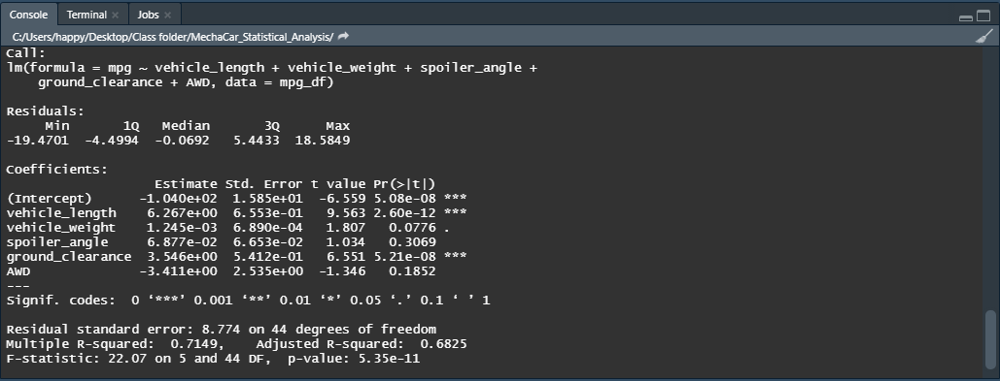
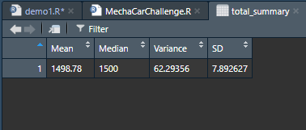
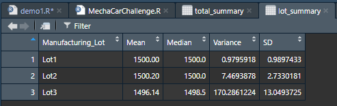
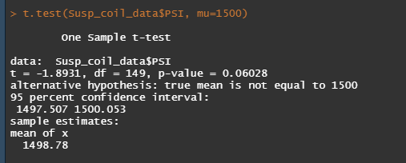
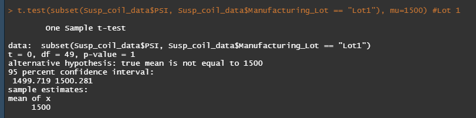
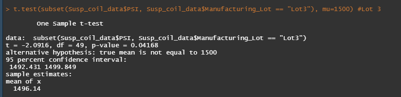

# MechaCar Statistical Analysis

We are reviewing the production data for insights that may help the manufacturing team of the new MechaCar.

## Linear Regression to Predict MPG

We are performing multiple linear regression analysis to identify which variables in the dataset(Vehicle length, vehicle weight, spoiler angle, ground clearance,drive type) can be used to predict the mpg of MechaCar prototypes.
### Results

### Summary
- Which variables/coefficients provided a non-random amount of variance to the mpg values in the dataset?

     - Ground Clearance and vehicle length very low p-value a which suggests that a null hypothesis is unlikely true, meaning the amount of variance they cause is likely non-random. 
The low p-value for intercept suggests we should reject the null hypothesis.

- Is the slope of the linear model considered to be zero? Why or why not?

    - The null hypothesis is a model with a slope equal or close to 0 (no relationship gives a flat line). The low p-value for intercept suggests we should reject the null hypothesis. In rejecting this we are saying the slope of our model is not 0.  There is a relationship between changes in our variables and the MPG of the vehicle.

- Does this linear model predict mpg of MechaCar prototypes effectively? Why or why not?

    - The r-squared (r2) value represents how well the regression model approximates real-world data points and it can be used as a probability metric to determine the likelihood that future data points will fit the linear model. Our value of 0.6825 suggests that we can predict MPG in future prototypes effectively. 

## Summary Statistics on Suspension Coils

The weight capacities of multiple suspension coils have been tested to determine if the manufacturing process is consistent across production lots.We are creating  summary statistics tables to show:
 - The suspension coil’s PSI continuous variable across all manufacturing lots
- The following PSI metrics for each lot: mean, median, variance, and standard deviation.

### Results
Total summary statistics table

Summary statistics by lot.

### Summary

- The design specifications for the MechaCar suspension coils dictate that the variance of the suspension coils must not exceed 100 pounds per square inch. 
  - Total Summary statistics table  
    - Looking at the summary for all lots we see that the mean and median are very close.  This suggests a **normal distribution**.
    - For normally distributed data three standard deviations account for 99.73 percent; and four standard deviations account for 99.994 percent of data.
    - With a SD of 7.9 we would expect the PSI for all coils to fall into a range of 1532 to 1468.
    -  **The overall variance is 62.3 which is under the 100 psi threshold.**
- Summary statistics by lot
    - Lot 1
        - The low SD and variance suggest all psi values gathered tightly around the mean. **Variance within guideline**
    - Lot 2 
        - Slightly higher SD and larger variance suggest this lot is more spread out than Lot 1 but still well within guidelines. **Variance within guideline**
    - Lot 3 
        - **This lot has a variance of 170 psi which is greater than our accepted limit. This batch of coils, when looked at alone, fail.**
        - The SD shows us that these are spread out further from the mean.
        - The  variance of this Lot was previously hidden when we looked at the total of all groups. 

## T-Tests on Suspension Coils

One sample t-test used on the complete data set and then each production run individually. The data will be compared  to a population mean(1500) **The null hypothesis is mean is equal to 1500.** We will use the common 0.05 as a significance level, a p-value above this will mean we do not have sufficient evidence to reject the null hypothesis, and we would state that the two means are statistically similar.
### Results

 - The p-value for the first test containing all lots = 0.06 which is a little above the 0.05 threshold. 
    - Fail to reject null hypothesis. Means are statistically similar.

Lot 1 t-test.

     
- The p-value for Lot 1 = 1
    - Fail to reject null hypothesis 

Lot 2 t-test. 

- The p-value for Lot 2 = 0.6
    - Fail to reject null hypothesis

Lot 3 t-test

 

- The p-value for Lot 3 = 0.04
    - We can reject the null hypothesis, and accept alternative hypothesis(true mean is not equal to 1500)

 
 

## Study Design: MechaCar vs Competition

**Metric to compare**
- With fuel prices rising, the true cost of a car is increasingly influenced by fuel efficiency. Cost will be a factor that influences customers. We could compare cost of ownership (price plus fuel) of our prototypes to other manufacturers.

**Data needed**
- The data we need can be calculated from vehicle price/number of years it will hold value and a figure derived from the MPG rating and the average US miles driven.   
We will then create a cost of ownership $ figure.
- The same data would be then calculated for all our competitors vehicles.

**Hypothesis**
 - H0: MechaCar prototypes' cost of ownership is similar to competitor's vehicles in the same vehicles Ha: MechaCar prototypes' cost of ownership is statistically above or below that of competitor vehicles.

**Test type**
- As we have a continuous variable, and we are looking at multiple samples we can use an ANOVA test. 

