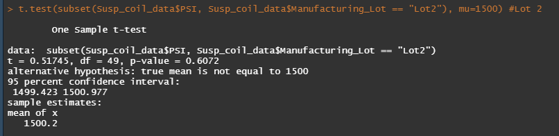

# MechaCar_Statistical_Analysis

We are reviewing the production data for insights that may help the manufacturing team.

## Linear Regression to Predict MPG
### Overview
We are performing multiple linear regression analysis to identify which variables in the dataset(Vehicle length, vehicle weight, spoiler angle, ground clearance,drive type) can be used to predict the mpg of MechaCar prototypes.
### Results

### Summary
- Which variables/coefficients provided a non-random amount of variance to the mpg values in the dataset?

     - Ground Clearance and vehicle length very low p-value a which suggests that a null hypothesis is unlikely true, meaning the amount of variance they cause is likely non-random. 
The low p-value for intercept suggests we should reject the null hypothesis.

- Is the slope of the linear model considered to be zero? Why or why not?

    - The null hypothesis is a model with a slope equal or close to 0 (no relationship gives a flat line). The low p-value for intercept suggests we should reject the null hypothesis. In rejecting this we are saying the slope of our model is not 0.  There is a relationship between changes in our variables and the MPG of the vehicle.

- Does this linear model predict mpg of MechaCar prototypes effectively? Why or why not?

    - The r-squared (r2) value represents how well the regression model approximates real-world data points and it can be used as a probability metric to determine the likelihood that future data points will fit the linear model. Our value of 0.6825 suggests that we can predict MPG in future prototypes effectively. 

## Summary Statistics on Suspension Coils
### Overview
The weight capacities of multiple suspension coils have been tested to determine if the manufacturing process is consistent across production lots.We are creating  summary statistics tables to show:
 - The suspension coil’s PSI continuous variable across all manufacturing lots
- The following PSI metrics for each lot: mean, median, variance, and standard deviation.

### Results
Total summary statistics table

Summary statistics by lot.

### Summary

- The design specifications for the MechaCar suspension coils dictate that the variance of the suspension coils must not exceed 100 pounds per square inch. Does the current manufacturing data meet this design specification for all manufacturing lots in total and each lot individually? Why or why not?

  - Total Summary statistics table  
    - Looking at the summary for all lots we see that the mean and median are very close.  This suggests a **normal distribution**.
    - For normally distributed data three standard deviations account for 99.73 percent; and four standard deviations account for 99.994 percent of data.
    - With a SD of 7.9 we would expect the PSI for all coils to fall into a range of 1532 to 1468.
    -  Variance = The average of the squared differences from the Mean.
    - **The overall variance is 62.3 which is under the 100 psi threshold.**
- Summary statistics by lot
    - Lot 1
        - The low SD and variance suggest all psi values gathered tightly around the mean. 
    - Lot 2 
        - Slightly higher SD and larger variance suggest this lot is more spread out than Lot 1 but still well within guidelines.
    - Lot 3 
        - **This lot has a variance of 170 psi which is greater than our accepted limit. This batch of coils, when looked at alone, fail.**
        - The SD shows us that these are spread out further from the mean.
        - The  variance of this Lot was previously hidden when we looked at the total of all groups. 

## T-Tests on Suspension Coils

### Overview
One sample t-test used on complete data set and then each production run individually.
### Results
All lots compared to population mean(1500)

Lot 1 t-test.
      

Lot 2 t-test. 

Lot 3 t-test

 

### Summary

## Study Design: MechaCar vs Competition

Write a short description of a statistical study that can quantify how the MechaCar performs against the competition. In your study design, think critically about what metrics would be of interest to a consumer: for a few examples, cost, city or highway fuel efficiency, horse power, maintenance cost, or safety rating.
In your description, address the following questions:
What metric or metrics are you going to test?
What is the null hypothesis or alternative hypothesis?
What statistical test would you use to test the hypothesis? And why?
What data is needed to run the statistical test?

